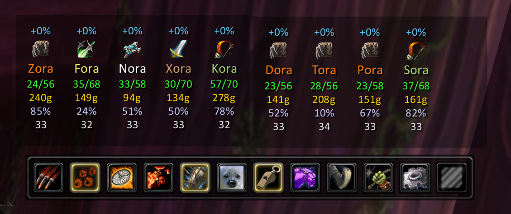

# AltBot

**English** | [Русский](прочтименя.md)

AltBot is a World of Warcraft **3.3.5a (WotLK)** addon for playing with [mod-playerbots](https://github.com/liyunfan1223/mod-playerbots)
bots on an AzerothCore server.

Most playerbots addons are built around **running raids with wild (random) bots**. AltBot is built around something else:
**questing and levelling with your own altbots** - your own alts (twinks) on the account, played by the bot AI while you lead them. One
character, the *master*, leads them; the addon gives you a stats board, an action bar and a set of per-bot windows (bags,
armory, strategies, quests, spellbook) and takes care of forming the raid, polling the bots, unloading their bags,
reviving them and so on. That focus shows: the quest log compares the quests of the whole team, the armory and bags let you
look after each altbot separately, Farm mode keeps a levelling team busy on its own. Wild bots work perfectly well too -
type a class word into the roster and the addon recruits and tracks them like any other bot (only their data is not kept
between sessions).

Everything goes through ordinary **whispers and group chat** - no server changes and no extra bridge addon are needed. If a
command works when you type it to a bot by hand, the addon can send it.

- [Requirements](#requirements) · [Installation](#installation) · [Quick start](#quick-start)
- [The action bar](#the-action-bar) · [Modes](#modes) · [The stats board](#the-stats-board)
- [Per-bot windows](#per-bot-windows) · [Settings and chat control](#settings-and-chat-control)
- [Vendors](#vendors) · [Trainers](#trainers) · [Slash commands](#slash-commands) · [Saved data](#saved-data) · [Limitations](#limitations)
- [Development](#development) · [Credits](#credits) · [License](#license)

## Requirements

- A WotLK 3.3.5a client and an AzerothCore server with **mod-playerbots**. The master must be allowed to use
  `.playerbots bot add / remove / addclass` (the addon sends them in `/s`).
- The bots must be able to answer plain whispers (`stats`, `items`, `who`, `spells`, `quests all`, `co ?`, `nc ?` ...); this is
  the default behaviour of mod-playerbots.
- Optional: **GearScoreLite** (the armory window then shows the same GearScore as the native frame).

## Installation

Copy the `AltBot` folder to `World of Warcraft/Interface/AddOns/`, so that `Interface/AddOns/AltBot/AltBot.toc` exists, and
restart the client (or choose the addon on the character screen). The spell, quest and zone tables are embedded in
`AltBot.lua`; the addon has no dependencies.

## Quick start

1. Log in with your master character. A small AltBot icon appears at the minimap; **left click** shows or hides the
   stats board together with the action bar, **right click** shows or hides the board only.
2. On the action bar click the **Roster** button (the beast-taming icon). Type the bots' names into the text box, separated by
   spaces, and press **Save**:
   - `Kora Nora Xora` - three named bots;
   - a class word, English or Russian (`warlock`, `dk`, `воин`, `жрец`, `дк`...), asks the server for one *wild* bot of that
     class (`.playerbots bot addclass`); two such words mean two bots;
   - your own name may be typed too, it is simply ignored;
   - a word starting with `-` is a comment and is skipped.
3. Pick a mode with the buttons **Quest Mode**, **Farm Mode** or **Solo Mode** (see [Modes](#modes)). The addon invites the
   bots, converts the party to a raid when it can and prints one line, e.g. `Quest mode, 8 bot(s).`
4. When the raid is formed the stats board appears: one frame per raid group, one column per member.

A raid needs the master and at least one bot of level 10 or higher (a server rule); below that you get a plain party of up to 5.

## The action bar

Left to right (the first six only exist in Quest mode):

| Button | What it does |
| --- | --- |
| Attack | the group attacks your current target |
| Follow / Stay | every bot follows you / stands still |
| Aggressive / Defensive / Passive | the bots' combat reaction |
| **Quest Mode** | summon the roster and let it follow you |
| **Farm Mode** | let the bots roam and grind on their own |
| **Solo Mode** | disband: put every bot away, you play alone |
| Roster | open the roster box |
| Gear | open the AltBot settings |
| empty grip icon | drag it to move the bar |

Follow/Stay, the reaction and the mode are **account-wide**: whatever one master sets is what the next master logs in with,
and the raid is put into that state once it has been formed.

## Modes

- **Solo** - the roster is removed from the world and nothing is polled. The board is hidden. The mode is remembered, so the
  next character on the account starts in Solo too.
- **Quest** - the bots follow you. The addon keeps the roster grouped, resets every bot's strategy to the default and applies
  your saved Follow/Stay and Aggressive/Defensive/Passive.
- **Farm** - the bots grind on their own (`nc +new rpg,-follow`). Every 30 s each bot is asked for `stats` and `rpg status`;
  a bot that is not grinding is sent grinding again. A bot with **full bags** is summoned, sells (`s *`, or `s vendor` if the
  *sell vendor* setting is on) and is sent exploring again; a **dead** bot is revived by a summon. Clicking the top row of a
  bot's column (the line with the hourly XP gain, e.g. `+2%`) **parks** it next to you (summon, reset, sell) and clicking again puts it back to work.

## The stats board

One independent, draggable frame per **raid group** (a single frame for a party). It is shown only after the raid has been
formed. The master is a column too, in the place the raid roster gives him. Each column shows, top to bottom: the XP gained
**this hour**, the class icon, the name, free/total bag slots, gold, XP % and level. A thin grey strip at the bottom lights
while that bot's `stats` reply is awaited. Data is saved, so the board is full right after a `/reload`; "wild" bots are not
saved and show `?` until their first reply.

| Click on... | Bot | Master |
| --- | --- | --- |
| class icon | armory window | character window |
| name | strategy window | strategies of the **whole group** |
| bags row | bags window | all bags |
| XP % | quest log window | the native quest log |
| level | spellbook window | the native spellbook |
| top row, the hourly XP gain `+N%` (Farm) | park / release the bot | - |

**Moving members between groups:** drag a column by its **class icon** onto another group's frame. If that group has a free
place the member moves there; if it is full, drop onto a member to swap places. (Needs raid leader or assistant.) While
dragging, the first empty group is offered as a target.

## Per-bot windows

All of them are independent, remember their position per bot and open instantly from saved data while a fresh request runs.
Shift-click on an item, spell or quest puts its link into the chat.

- **Armory** - a native-style paper doll built from per-slot queries (`who` plus one query per slot, about 20 whispers),
  with the model, GearScore, iLevel, spec and talents. Closing it while a query is in flight is "fictive": it turns
  invisible and really closes when the last query is answered, so the trade window the bot opens is still suppressed.
  It works **at any distance**: the bot does not have to be near you (or even in view), because everything is read from its
  chat replies, not by inspecting it. Only the 3D model needs the bot in view once per session.
- **Bags** - the bot's inventory from its `items` reply. Left click does the action chosen in the footer (*Sell* or *Trade*,
  click the left or right half), right click opens a menu. The window supports **selling** (to a vendor the bot stands at),
  **trading** (item moves to you through a trade window), **equipping** (the bot puts the item on), **depositing to the guild bank**
  and **destroying**, plus a Wowhead link; items can be dragged to reorder. Free slots come from `stats`. **These operations work in Quest mode only**: in
  Farm mode the bags window is view-only (the exception is a bot you have *parked*, see [Modes](#modes)).
- **Strategies** - the combat and non-combat forms in the style of CleanBot (dropdowns, checkboxes, a delay slider); changes
  are sent as `co ...` / `nc ...` and the window follows commands typed by hand too. Clicking the **master's** name opens the
  same form for the **whole group**: every change goes to all bots (the Role dropdown is disabled there; a checkbox that is
  on for some bots only is shown white with a `*`). A **Find** dropdown (None / Herb / Ore) keeps the Find Herbs / Find
  Minerals tracking on.
- **Quest log** - unfinished quests **grouped by zone**, completed ones last. Columns: quest id, `[N]` (how many raid members,
  bots and the master, have the quest), the quest link and its Russian title. Right click **drops** the quest on that bot.
  The master's *native* quest log shows the same raid-wide `[N]` instead of the group-only number.
- **Spellbook** - the bot's spells in five groups: its three talent trees (English and Russian name), *Professions* and
  *Other*. Left click makes the bot cast the spell, right click creates a macro `/w <bot> cast <spell>` and puts it on your
  cursor, so you can drop it on an action bar and fire it at the right moment of a fight.

## Settings and chat control

Click the gear on the action bar. At the top a small chart shows how much memory the addon itself uses (a measurement every
5 minutes, one bar per hour with the hourly average). Below are the checkboxes:

- **sell vendor** - sell with `s vendor` instead of `s *`.
- **chat init / stats / farm / inventory / armory / strategies / questlog / spellbook** - by default **nothing** the addon
  does reaches your chat. Tick an area to watch only that: its commands, the bots' replies and the addon's own messages.
  `init` also takes everything that fits no other area (loading, group forming, mode switches, failures). Only the
  *mode line* and the supply **alarms** (a hunter without ammo, a rogue without poison - printed red on yellow) are always
  shown. Your own manual whispers and chat are never hidden.
- **dance** - in Quest mode the group is told `emote dance` every 10 s; the master announces it in `/s`.
- **emotes** - in Quest mode, every 5 minutes one random bot makes a random animated emote.
- **delete cache** - the addon starts every time as if it were the very first run (all saved data is wiped). Meant for debugging.

## Vendors

- Opening a vendor window makes **every tracked bot** whisper-sell its junk (`s *` / `s vendor`); the bots near that vendor
  sell, the others have nobody to sell to.
- In **Quest mode, with a bot in your target**, an item you click at the vendor is bought **for that bot** (`b <item link>`
  whispered to it, once per lot, with a coin sound): its gold and item count are updated at once and its real slot count
  follows from the next `stats`. Without a bot target the purchase is yours as usual.

## Trainers

Open **any** trainer window with the master - a class trainer or a profession trainer - and every tracked bot is whispered
`trainer`. Each bot learns what it can afford from that trainer, **wherever it is**, even on another continent (it does
not have to be near you). It works in **Quest and in Farm mode** alike (the bots can keep farming meanwhile); only Solo
mode has no bots to teach. The addon collects the replies and, when the **chat init** checkbox is on, prints one line per
bot and skill - the skill, its cost and whether it was learned or is too expensive - or `nothing to learn`. It is
triggered only by the master's own deliberate visit to a trainer, never by a bot merely standing near one, so the bots
do not spend gold for no visible reason.

## Slash commands

Only two diagnostic helpers: `/abfocus` (then point at some UI within 4 seconds - prints the frame under the cursor) and
`/abglobals Prefix` (lists global tables whose names start with Prefix).

## Saved data

`AltBot_SavedVars` (account-wide): the roster text, the mode, follow/stay and reaction, window and board positions, settings,
and caches (bags, equipment, `who`, quest lists, spell lists, last board numbers, hourly XP). Caches of **wild-class** bots are
erased at logout. The memory chart is not saved.

## Limitations

- It was built against one server's configuration. There the `grind` and `aggressive` strategies are disabled, so bots only
  fight what attacks them while roaming; targeted farming (skinning, picking a mob to kill) and walking a bot to a gathering
  node are **not possible**. Bots gather a node only when they pass right next to it.
- Some commands are spelled the way mod-playerbots 3.3.5 builds accept them (`b <link>` to buy, `emote <name>`, `quests all`,
  `spells`). On another build a spelling may differ - then the matching feature simply does nothing.
- The addon only checks syntax outside the game; it was tested in the client by its author.

## Development

`AltBot.lua` is one big file; its main chunk is close to Lua 5.1's limit of 200 local variables, so new helpers hang on the
`NS` table. Checks used: `luac -p AltBot.lua` and the Lua language server (`.luarc.json`, API stubs in
`wow-stubs/wow-api.lua`). The embedded data tables are generated offline from the sources below (the generator scripts are
not part of this repository). `playerbot.txt` is a Russian translation of the mod-playerbots configuration file, kept for
reference.

## Credits

- Spell / talent-tree tables: Wowhead (WotLK Classic).
- Quest titles and quest zones: generated from the data of the author's own QuestChromeCraft addon.
- Zone names and their Russian translations: the Questie addon's tables.
- The strategy window follows the layout of CleanBot's strategy panel.

## License

[MIT](LICENSE). The embedded data tables come from the sources above and keep their own terms.
